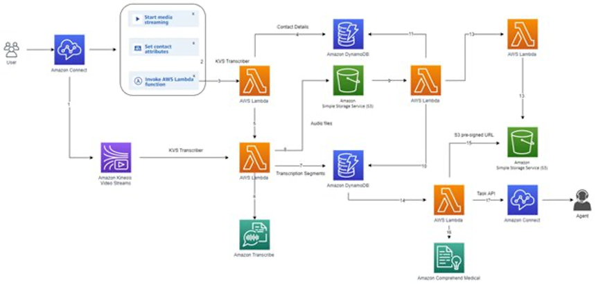
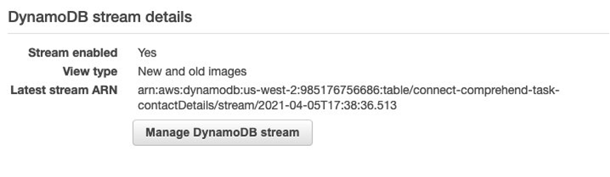
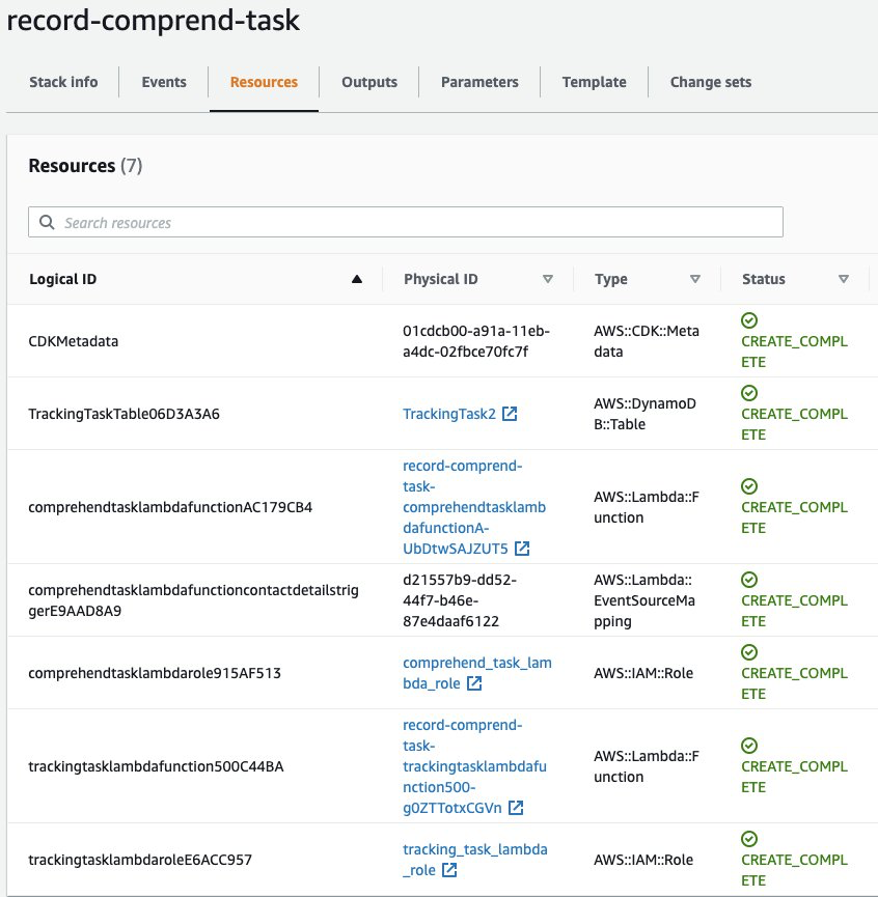
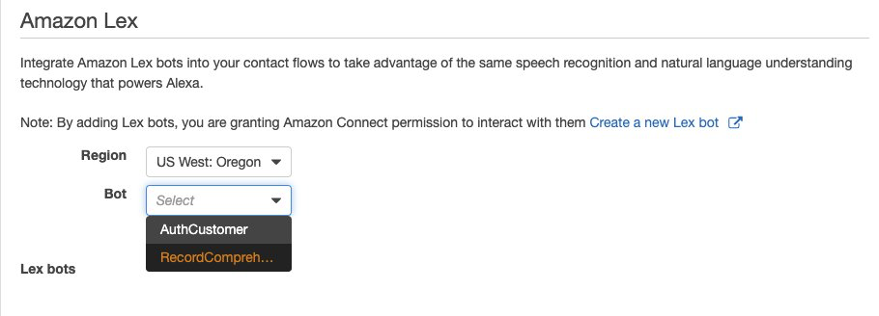
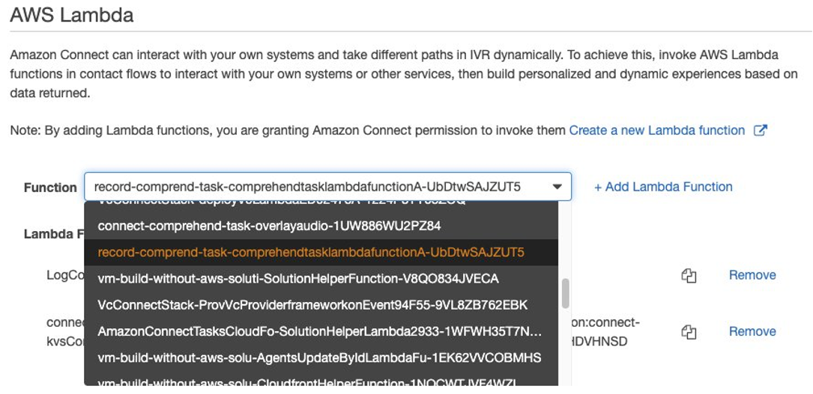
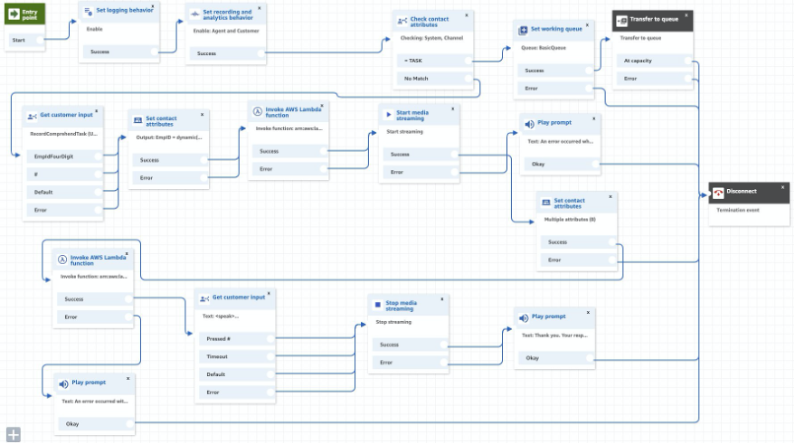

# Introduction

This project demonstrates how to create an Amazon Connect task from a phone call with Amazon Transcribe and Comprehend. This can be an alternative to a voicemail, except that the "voicemail" is turned into a Connect Task, which gets routed/assigned.  

## Solution Overview



# About your CDK Python project

You should explore the contents of the repo. The `cdk.json` file tells the CDK Toolkit how to execute your application. 

This project is set up like a standard Python project.  The initialization process also creates
a virtualenv within this project, stored under the .venv directory.  To create the virtualenv
it assumes that there is a `python3` executable in your path with access to the `venv` package.
If for any reason the automatic creation of the virtualenv fails, you can create the virtualenv
manually once the init process completes.

To manually create a virtualenv on MacOS and Linux:

```
$ python3 -m venv .venv
```

After the init process completes and the virtualenv is created, you can use the following
step to activate your virtualenv.

```
$ source .venv/bin/activate
```

If you are a Windows platform, you would activate the virtualenv like this:

```
% .venv\Scripts\activate.bat
```

Once the virtualenv is activated, you can install the required dependencies.

```
$ pip install -r requirements.txt
```

At this point you can now synthesize the CloudFormation template for this code.

```
$ cdk synth
```

You can now begin exploring the source code, contained in the hello directory.
There is also a very trivial test included that can be run like this:

```
$ pytest
```

To add additional dependencies, for example other CDK libraries, just add to
your requirements.txt file and rerun the `pip install -r requirements.txt`
command.

## Useful commands

 * `cdk ls`          list all stacks in the app
 * `cdk synth`       emits the synthesized CloudFormation template
 * `cdk deploy`      deploy this stack to your default AWS account/region
 * `cdk diff`        compare deployed stack with current state
 * `cdk docs`        open CDK documentation


# Deploy the solution

1. Clone this repo to your local computer
2. Follow the instructions from the `About your CDK Pyton project` above to prepare the CDK Python environment in the folder you clone the repo above
3. Make sure that you set the proper AWS_PROFILE in your environment (as this set of account/region/credentials will be used by CDK)
    - On Mac: `export AWS_PROFILE=user1` where user1 is the name of your aws profile in the $HOME/.aws folder
    - On Windows: `setx AWS_PROFILE user1`,  where user1 is the name of your aws profile in the $HOME/.aws folder
4. Bootstrap your account and region: `cdk bootstrap`
5. Go the the AWS DynamoDB Console, select table contactDetails 
    - Select Manage DynamoDB Stream , select New and old images, and Enable the stream
    - Note the Latest stream ARN
    
6. Update the `cdk.json` file with appropriate context parameters (`instanceId`, `contactFlowId`, and `eventSourceArn`). 
    - eventSourceArn is the Latest stream ARN value in step 5
7. Deploy the solution with `cdk deploy`, and wait for it to finish
8. Check the deployed resource by going to the AWS CloudFormation Dashboard, select that stack that has just been deployed (record-comprend-task), and select the Resources tab. Note the following lambdas (whose ARN’s will be used in the Contact Flow in step 13):
    - Logical ID starts with `comprehendtasklambda`
    - Logical ID starts with `trackingtasklambda`
    
9. Import the Amazon Lex bot
    - Go to the Amazon Lex Console.
    - On the Actions dropdown menu, choose Import.
    - Browse to `assets` folder and select the `RecordComprehendTask.zip` file to import
    - Create and publish the Lex bot
10. Enable the Lex bot for use in your Contact Flow.
    - Go to the AWS Connect Console, select your instance, then select Contact Flows on the left panel
    - Add  the Lex bot that you created in step 4 for use in your Contact Flows
    
11. Enable the Lambdas for use in your Contact Flow
    
12. Import the Contact Flow. 
    - Open the `kvsStreamingFlow` CF deployed in the prerequisite Amazon Connect real time transcription solution
    - Replace it by importing the `kvsStreamingFlow.json` CF in the assets folder
13.	Update the `kvsStreamingFlow` CF with appropriate Lex bot and Lambdas
    - Update the `Invoke AWS Lambda function` block with the `kvsConsumerTrigger` lambda deployed in the prerequisite Amazon Connect real time transcription solution.
    - Update the `Get customer input` block with the Lex bot deployed in step 9
    - Update the `Invoke AWS Lambda function` block with the `trackingtasklambda` function deployed in step 3. 
    - Go to the AWS Connect Console, select your instance, then select Contact Flows on the left panel.
    - Add the two lambdas you noted in step 8 for use in your Contact Flows.
    - Note that the lambda that starts with `kvsConsumerTrigger` should’ve already been added when deploying the pre-requisite Amazon Connect real time transcription solution.
    

# Testing
1.	In your Amazon Connect instance, choose the Routing icon from the navigation bar, and choose phone numbers.
2.	Choose the phone number you want to associate with your new contact flow to edit.

# Clean up
1. Run `cdk destroy` on the stack deployed in this solution.
2. Go to the Amazon Lex Dashboard and delete the Lex bot created in step 9.

# Security
See [CONTRIBUTING](https://github.com/aws-samples/connect-task-creation-for-voicemail/blob/main/CONTRIBUTING.md#security-issue-notifications) for more information.

# License
This library is licensed under the MIT-0 License. See the LICENSE file.


